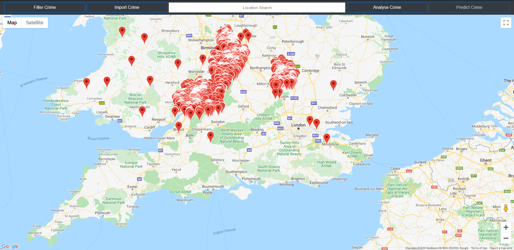

# Crime Mapper
A web-based crime mapping, visualisation and analysis solution developed using HTML, CSS, JavaScript, PHP, SQL and the Google Maps JavaScript API.

### Known Issues ###  
* IE11 is not supported
* Not responsive for mobile devices 
* Larger resolutions (above 1920x1080) are untested
* API Key is visible (key is restricted to website domain with quota limits)
