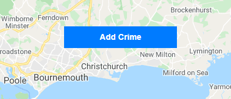
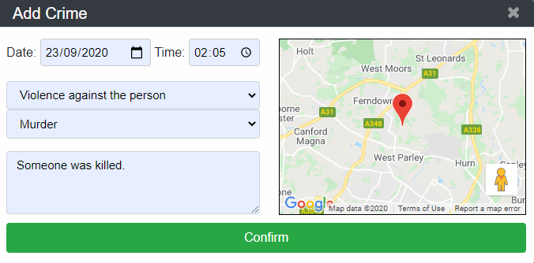
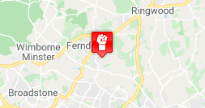
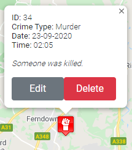
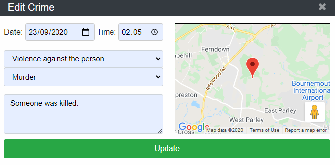
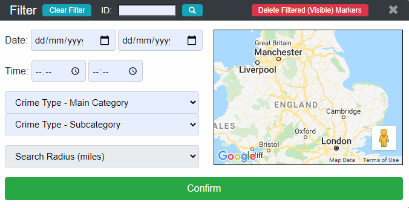

# Crime Mapper

A web-based crime mapping, visualisation and analysis solution (**[Live Demo](http://ec2-35-178-182-176.eu-west-2.compute.amazonaws.com)**)

## Table of contents
* [Programming Languages](#ProgrammingLanguages)
* [Built with](#Builtwith)
	
## Programming Languages
* HTML
* CSS
* JavaScript
* PHP
* SQL

## Built with
* Google Maps JavaScript API
* MySQL
* BootStrap (v4.4.1)
* jQuery (v3.4.1)

## Usage / Instructions
### Crime Icons
| Icon | Description | Icon | Description |
|--|--|--|--|
|  | Violence against the person |  | Possession of weapons |
|  | Public Order |  | Theft |
|  | Drug offences |  | Burglary |
|   | Vehicle offences |  | Robbery |
|  | Sexual offences |  | Miscellaneous crimes | 
|  | Arson and criminal damage |  | Other |

### Add Crime

**1)** Right click anywhere on the map and select the 'Add Crime' option (from the context menu which appears):

**2)** Enter the crime's information using the input fields:

*(**Note**: The crime location can be adjusted using the marker and smaller map provided)*

**3)** Click the 'Confirm' button for the crime to be added to the mapper:

### View Crime

**1)** Left clicking on a marker will open a small window displaying information about the crime (current properties):

### Edit Crime

**1)** From the window that appears when viewing a crime, click the 'Edit' button:

**2)** Edit the crime's information using the input fields:

*(**Note:** The inputs fields will begin as to reflect the crime's current information)*

**3)** Click the 'Confirm' button to save the edits made.

### Delete Crime

**1)** To remove a single instance of crime, from the window that appears when viewing that crime, click the 'Delete' button:

(**Note:** This will **permanently remove** the crime marker from the mapper).

### Filter Crime

**1)** From the main toolbar, click the 'Filter Crime' button:

**2)** Enter the desired filter criteria with the provided fields:

*(**Note:** Where there are two fields for a crime attribute, the first field is a minimum value and the second field is a maximum value)*

* **2.1)** To include a geographic area in the filter criteria, first click on the smaller map provided:

* **2.2)** This will enable the 'Search Radius (miles) field'. Selecting a radius from this list will display the area to filter by on the map:

**3)** Click the 'Confirm' button to filter all markers by the constructed filter criteria.

#### Clear Filter

**1)** Click the 'Filter Crime' button at the top of the window:

**2)** (Optional) Click the 'Confirm' button to show all markers (apply no filter).

#### Filter by ID

**1)** Enter an ID in the field at the top of the window:

**2)** Click the search button (beside the input field).

#### Delete Filtered Crime

**1)** All the crimes that meet the currently active filter criteria can be deleted all at once by clicking the 'Delete Filtered (Visible) Markers' button:

**2)** A progress bar showing the deletion process will appear:

**3)** Once the process has finished, the mapper will reload (and the deletions made will be reflected on the mapper).

### Import Crime

**1)** From the main toolbar, click the 'Import Crime' button:

### Analyse Crime

**1)** From the main toolbar, click the 'Analyse Crime' button:

**2)** All currently visible markers will be grouped into differently coloured clusters based on how close they are to other markers (represents the density of crime). The number of crimes in each cluster is shown with white text in the middle of the cluster icon. The three different cluster icons and the minimum number of crimes they represent is as follows:
| Cluster | Amount |
|--|--|
|  | 2 - 10 |
|  | 11 - 99 |
|  | 100+ |

**3)** To turn off the clustering, click the 'Analyse Crime' button again (the button acts as a toggle). 

### Predict Crime

Crime prediciotn functionality is not yet implemented. This feature will be added soon.

### Known Issues ###  
* IE11 is not supported
* Not responsive for mobile devices (mobile version in development)
* Larger resolutions (above 1920x1080) are untested
* Import and multiple marker deletion functionality not performed