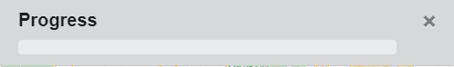

# Crime Mapper
A web-based crime mapping, visualisation and analysis solution using the Google Maps JavaScript API

## Table of Contents
* [Usage / Instructions](#usage--instructions)
    * [Crime Icons](#crime-icons)
    * [Add Crime](#add-crime)
    * [View Crime](#view-crime)
    * [Edit Crime](#edit-crime)
    * [Delete Crime](#delete-crime)
    * [Filter Crime](#filter-crime)
        * [Filter by ID](#filter-by-id)
        * [Delete Filtered Crime](#delete-filtered-crime)
    * [Import Crime](#import-crime)
    * [Analyse Crime](#analyse-crime)
        * [Cluster Icons](#cluster-icons)
* [Known Issues](#known-issues)

## Usage / Instructions
### Crime Icons
| Icon | Description | Icon | Description |
|--|--|--|--|
|  | Violence against the person |  | Possession of weapons |
|  | Public Order |  | Theft |
|  | Drug offences |  | Burglary |
|   | Vehicle offences |  | Robbery |
|  | Sexual offences |  | Miscellaneous crimes | 
|  | Arson and criminal damage |  | Other |

### Add Crime

**1)** Right click anywhere on the map and select the 'Add Crime' option (from the context menu which appears):

**2)** Enter the crime's information using the input fields:

*(**Note**: The crime location can be adjusted using the marker and smaller map provided)*

**3)** Click the 'Confirm' button for the crime to be added to the mapper:

### View Crime

**1)** Left clicking on a marker will open a small window displaying information about the crime (current properties):

### Edit Crime

**1)** From the 'View Crime' for a crime, click the 'Edit' button:

**2)** Edit the crime's information using the input fields:

*(**Note:** The inputs fields will begin as to reflect the crime's current information)*

**3)** Click the 'Confirm' button to save the edits made.

### Delete Crime

**1)** To remove a single instance of crime, from the 'View Crime' for a crime, click the 'Delete' button:

(**Note:** This will **permanently remove** the crime marker from the mapper).

### Filter Crime

**1)** From the main toolbar, click the 'Filter Crime' button:

**2)** Enter the desired filter criteria with the provided fields:

*(**Note:** Where there are two fields for a crime attribute, the first field is a minimum value and the second field is a maximum value)*

**2.1)** To include a geographic area in the filter criteria, first click on the smaller map provided:

**2.2)** This will enable the 'Search Radius (miles)' field. Selecting a radius will display the area to filter by on the map:

**3)** Click the 'Confirm' button to filter all markers by the constructed filter criteria.

#### Clear Filter

**1)** Click the 'Clear Filter' button at the top of the window:

**2)** (Optional) Click the 'Confirm' button to show all markers (apply no filter).

#### Filter by ID

**1)** Enter an ID in the field at the top of the window:

**2)** Click the search button (beside the input field).

#### Delete Filtered Crime

**1)** All the crimes that meet the currently active filter criteria can be deleted all at once by clicking the 'Delete Filtered (Visible) Markers' button:

**2)** A progress bar showing the deletion process will appear:

**3)** Once the process has finished, the mapper will reload (and the deletions made will be reflected on the mapper).

### Import Crime

**1)** From the main toolbar, click the 'Import Crime' button:

**2)** (Optional) Click the 'Download Template' button to begin creating an import file OR the 'Browse Files' to be navigated to supported data downloads:

**3)** Click the 'Browse' button and select the file to import using the dialog:

**4)** Click the 'Import' button to begin importing the selected file.

**5)** The two progress bars will update (the top bar showing progress of the file upload and the bottom bar showing the progress of the import process):

**6)** Once the import process has finished (both progress bars complete), the mapper will reload (and the insertions made will be reflected on the mapper):

### Analyse Crime

**1)** From the main toolbar, click the 'Analyse Crime' button:

**2)** Markers will be grouped into clusters based on how close they are to other markers (representing the density of crime). The number of crimes in each cluster is shown with white text (in the middle of the cluster icon):

#### Cluster Icons

The three different cluster icons and the minimum number of crimes they represent is shown in the table below:
| Cluster | Amount |
|--|--|
|  | 2 - 9 |
|  | 10 - 99 |
|  | 100+ |

**3)** To turn off the clustering, click the 'Analyse Crime' button again (the button acts as a toggle).

### Predict Crime

Not yet implemented.

## Known Issues
* Database configuration details tracked within version control
* API calls (and therefore the API key) are client-side
* IE11 is not supported
* Not responsive for mobile devices
* Larger resolutions (above 1920x1080) are untested
